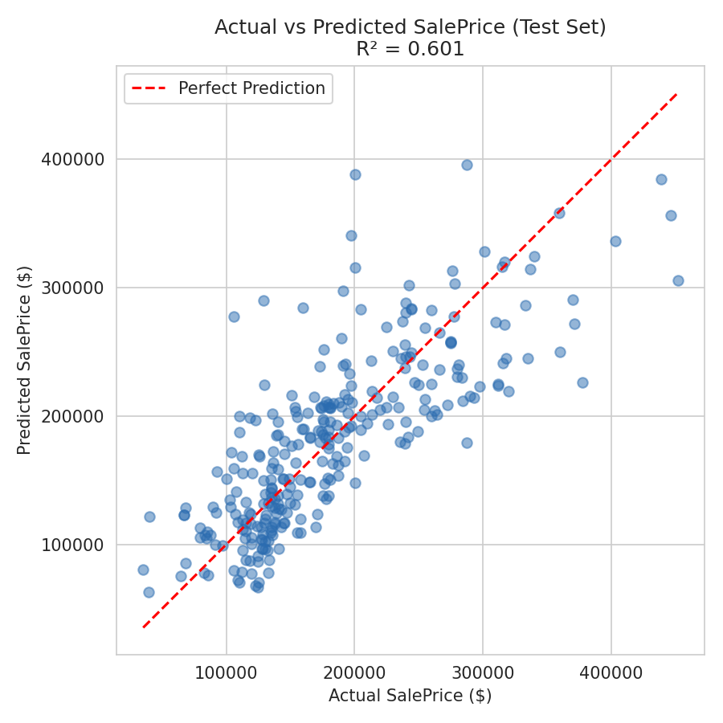

# House Price Prediction — Linear Regression

A simple linear regression model that predicts house sale prices based on:
- Square footage (GrLivArea)
- Number of bedrooms (BedroomAbvGr)
- Number of bathrooms (FullBath + 0.5 * HalfBath)

## Dataset
[Kaggle House Prices - Advanced Regression Techniques](https://www.kaggle.com/c/house-prices-advanced-regression-techniques/data)

## How to run
1. Download `train.csv` from the Kaggle link above.
2. Place it in the same folder as `house_price_linear_regression.py`.
3. Install dependencies:

## Results
The model achieved an R² of ~0.63 on the test set, meaning it explains about 63% of the variation in house prices using just these 3 features.

## Tech stack
- Python
- pandas, numpy
- scikit-learn (LinearRegression)
- matplotlib (visualization)

- ## Visualization

